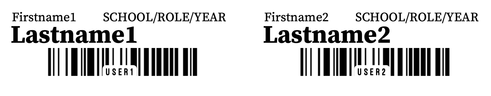

# labelGenerator.py

This python script generates student, staff, and faculty labels from a list of usernames using Active Directory information.

> **WARNING :** _The current school year must be updated in labelGenerator.py each summer! Check set year with `-v`_

# Recommended Installation

Check that Git and Python3 are set up properly by running:

```console
git --version
python3 --version
```

Run the following in order:

```console
sudo git clone https://github.com/ccsnetadmin/studentLabels.git /usr/local/bin
```

```console
sudo python3 -m pip install -r /usr/local/bin/studentLabels/requirements.txt
```

```console
sudo printf "\nalias label=\"python3 /usr/local/bin/studentLabels/labelGenerator.py\"\n" >> ~/.zprofile
```

## Updating

Run the following:

```console
sudo git pull https://github.com/ccsnetadmin/studentLabels.git /usr/local/bin && sudo python3 -m pip install -r /usr/local/bin/studentLabels/requirements.txt
```

<br/>
<br/>

# Usage

## Interactive

`labelGenerator.py`

Running this script without arguments will show an interactive CLI 

```console
~$ python3 labelGenerator.py

Enter student Usernames separated by commas: user1, user2
Enter the first available label or press enter for A1: B5
Beginning labels at [2, 5]

>  Generated [user1] - Firstname1 Lastname1
>  Generated [user2] - Firstname2 Lastname2

Document Saved as Labels.pdf on Desktop
2 label output on 1 page.
```



## CLI

`labelGenerator [-h] [-s START] [-n] [-f CSV_FILE] [--head HEAD] [-v] [N ...]`

| Flag/Argument | Use |
|:--|:--|
| `-h` | Show help |
| `-s START` | Specify start position for labels |
| `-n` | Use default (saved) start position for labels |
| `-f CSV_FILE` | Specify a .csv file of usernames |
| `--head HEAD` | Specify a number of csv header rows to ignore |
| `-v` | show version information and current school year |
| `[N ...]` | usernames can be entered directly via arguments to bypass the interactive prompt|

<br/>
<br/>

# Python3 Dependencies
- [`pylabels`](https://github.com/bcbnz/pylabels/)` == 1.2.1`
- [`python-barcode`](https://github.com/WhyNotHugo/python-barcode)` == 0.14.0`
- [`reportlab`](http://www.reportlab.com/)` == 3.6.12`
- [`pillow`](https://python-pillow.org)` == 10.1.0`